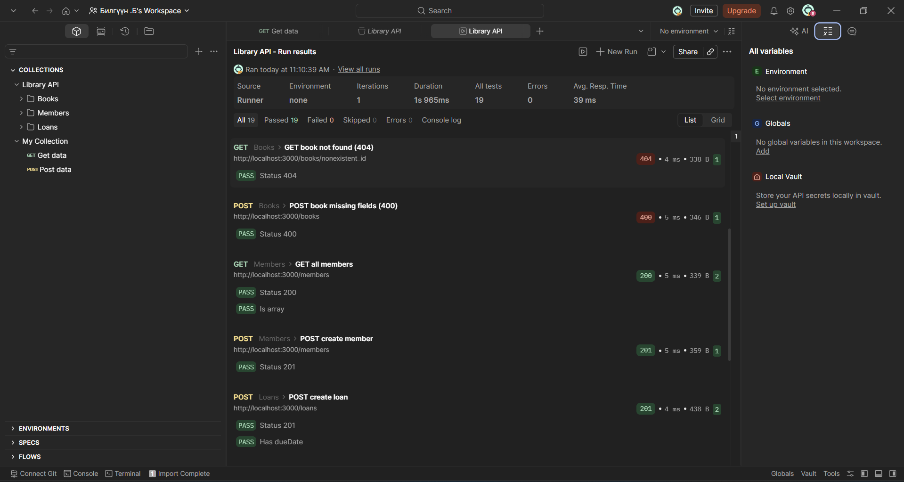

# Б хэсэг — Library Management REST API

## Тойм

Express.js ашиглан номын сангийн удирдлагын REST API хэрэгжүүллээ.
Нийт 4 endpoint бүлэг: /books, /members, /loans, /reservations.

## Ажиллуулах

```bashnpm install
npm run start

API: http://localhost:3000

## Endpoint-уудын жагсаалт

### Books
| Method | URL | Тайлбар |
|--------|-----|---------|
| GET | /books | Бүх номын жагсаалт (pagination, filtering) |
| GET | /books/:id | Нэг ном авах |
| POST | /books | Шинэ ном нэмэх |
| PUT | /books/:id | Ном шинэчлэх |
| DELETE | /books/:id | Ном устгах |

### Members
| Method | URL | Тайлбар |
|--------|-----|---------|
| GET | /members | Бүх гишүүдийн жагсаалт |
| GET | /members/:id | Нэг гишүүн авах |
| POST | /members | Шинэ гишүүн нэмэх |
| PUT | /members/:id | Гишүүн шинэчлэх |
| DELETE | /members/:id | Гишүүн устгах |

### Loans
| Method | URL | Тайлбар |
|--------|-----|---------|
| GET | /loans | Бүх зээлийн жагсаалт |
| POST | /loans | Ном зээлэх |
| PUT | /loans/:id/return | Ном буцаах |
| PUT | /loans/:id/renew | Зээл сунгах (нэг удаа) |

### Reservations
| Method | URL | Тайлбар |
|--------|-----|---------|
| GET | /reservations | Бүх захиалгын жагсаалт |
| POST | /reservations | Ном захиалах |
| DELETE | /reservations/:id | Захиалга цуцлах |

## Бизнесийн дүрмүүд

- Нэг гишүүн нэг дор хамгийн ихдээ **5 ном** зээлж болно
- Зээлийн хугацаа **14 хоног**
- Зээлийг зөвхөн **нэг удаа** сунгах боломжтой (14 хоногоор)
- Буцаагдсан зээлийг дахин буцааж эсвэл сунгаж болохгүй

## HTTP статус кодууд

| Код | Утга |
|-----|------|
| 200 | Амжилттай |
| 201 | Шинэ объект үүссэн |
| 204 | Устгагдсан (контент байхгүй) |
| 400 | Буруу хүсэлт (шаардлагатай талбар дутуу) |
| 404 | Олдсонгүй |
| 409 | Зөрчил (ном боломжгүй, хязгаар хэтэрсэн) |

## Алдааны формат (RFC 7807)

```json{
"type": "about:blank",
"title": "Not Found",
"status": 404,
"detail": "Book book_123 not found"
}

## Postman тест

- Collection: `postman/Library-API.postman_collection.json`
- Нийт тест: 19
- Давсан: 19/19



## Хавтасны бүтэцpartB/
├── src/
│   ├── middleware/
│   │   └── errorHandler.ts
│   ├── routes/
│   │   ├── books.ts
│   │   ├── members.ts
│   │   ├── loans.ts
│   │   └── reservations.ts
│   ├── app.ts
│   ├── db.ts
│   └── types.ts
├── postman/
│   ├── Library-API.postman_collection.json
│   └── test-results.png
├── openapi.yaml
├── package.json
└── tsconfig.json